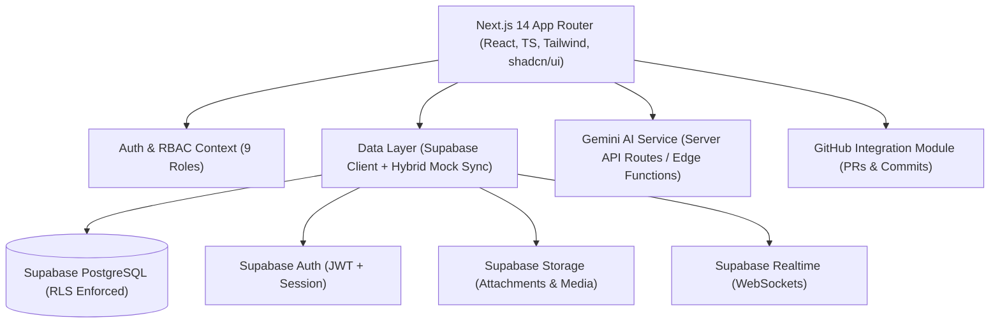
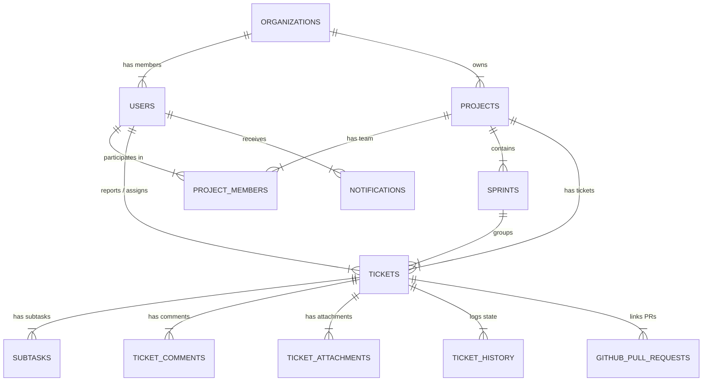

# Implementation Plan - Dettroin Engineering & Project Management System

**Dettroin Engineering & Project Management System** is a production-ready internal SaaS platform engineered specifically for software development teams. It seamlessly bridges the communication gap between Frontend Developers, Backend Developers, QA/Testers, Team Leads, Project Managers, and Admins.

---

## 1. System Architecture



### Key Architectural Principles
- **Frontend Core**: Next.js 14 (App Router) with TypeScript, Tailwind CSS, shadcn/ui, Zod validation, React Hook Form, and TanStack Query.
- **Backend Infrastructure**: Supabase (PostgreSQL DB, Auth, Storage, Realtime, RLS policies).
- **Hybrid Data Resilience**: Provides standard direct Supabase client integration while embedding an in-memory/localStorage seed store so the app can be immediately demonstrated, tested, and validated visually before or alongside backend execution.
- **Security First**: All Gemini AI keys and GitHub client credentials are strictly server-side (`src/app/api/...`), ensuring zero token leakages to the client browser.

---

## 2. Folder Structure

```
c:/Users/PC/Desktop/ticket system/
├── docs/
│   ├── ARCHITECTURE.md
│   ├── DATABASE.md
│   ├── AUTHENTICATION.md
│   ├── AI.md
│   └── DEPLOYMENT.md
├── supabase/
│   ├── migrations/
│   │   ├── 00001_initial_schema.sql
│   │   └── 00002_rls_policies.sql
│   └── seed.sql
├── src/
│   ├── app/
│   │   ├── (auth)/
│   │   │   ├── login/
│   │   │   ├── register/
│   │   │   └── reset-password/
│   │   ├── (dashboard)/
│   │   │   ├── dashboard/
│   │   │   │   ├── admin/
│   │   │   │   ├── pm/
│   │   │   │   └── developer/
│   │   │   ├── projects/
│   │   │   │   ├── [id]/
│   │   │   │   │   ├── kanban/
│   │   │   │   │   ├── sprints/
│   │   │   │   │   └── page.tsx
│   │   │   │   └── page.tsx
│   │   │   ├── tickets/
│   │   │   │   ├── [id]/
│   │   │   │   └── page.tsx
│   │   │   ├── my-work/
│   │   │   ├── notifications/
│   │   │   ├── reports/
│   │   │   ├── ai-assistant/
│   │   │   └── settings/
│   │   ├── api/
│   │   │   ├── ai/
│   │   │   │   ├── summarize/
│   │   │   │   ├── classify/
│   │   │   │   ├── suggest-priority/
│   │   │   │   ├── detect-duplicate/
│   │   │   │   └── bug-analysis/
│   │   │   └── github/
│   │   │       └── webhook/
│   │   ├── globals.css
│   │   └── layout.tsx
│   ├── components/
│   │   ├── ui/ (Button, Dialog, Dropdown, Table, Toast, Badge, Avatar, Skeleton, Tabs, Input, Select)
│   │   ├── layout/ (Sidebar, TopNav, Header, NotificationCenter)
│   │   ├── projects/ (ProjectCard, ProjectHeader, ProjectForm)
│   │   ├── tickets/ (TicketCard, TicketDetailModal, CreateTicketModal, TicketFilters, WorkflowStatusBadge)
│   │   ├── comments/ (CommentThread, MentionInput, MarkdownEditor)
│   │   ├── kanban/ (KanbanBoard, KanbanColumn, DragDropTicketCard)
│   │   ├── sprints/ (SprintHeader, BurndownChart, SprintPlannerModal)
│   │   ├── github/ (PRLinkBadge, CommitLinkBadge, GitHubConnectWidget)
│   │   └── ai/ (AITicketSummarizer, AIDuplicateAlert, AIFixAssistantModal)
│   ├── context/
│   │   ├── AuthContext.tsx
│   │   ├── RealtimeContext.tsx
│   │   └── ThemeContext.tsx
│   ├── lib/
│   │   ├── supabase/ (client.ts, server.ts, middleware.ts)
│   │   ├── gemini/ (client.ts, prompts.ts)
│   │   ├── github/ (client.ts, parser.ts)
│   │   └── utils.ts
│   ├── types/
│   │   ├── database.ts
│   │   ├── tickets.ts
│   │   ├── rbac.ts
│   │   └── github.ts
│   └── tests/
├── .env.example
├── README.md
├── tailwind.config.js
├── tsconfig.json
└── package.json
```

---

## 3. Database ER & Schema Design (PostgreSQL / Supabase)

### Enums
- `user_role`: `'super_admin'`, `'admin'`, `'project_manager'`, `'team_lead'`, `'developer'`, `'frontend_developer'`, `'backend_developer'`, `'qa_tester'`, `'client_user'`
- `project_status`: `'planning'`, `'active'`, `'on_hold'`, `'completed'`, `'archived'`
- `ticket_type`: `'bug'`, `'task'`, `'feature'`, `'improvement'`, `'question'`, `'api_issue'`, `'ui_issue'`, `'integration_issue'`, `'database_issue'`, `'deployment_issue'`, `'security_issue'`, `'technical_debt'`
- `ticket_status`: `'open'`, `'triaged'`, `'assigned'`, `'in_progress'`, `'blocked'`, `'code_review'`, `'ready_for_testing'`, `'testing'`, `'changes_requested'`, `'resolved'`, `'closed'`, `'reopened'`
- `ticket_priority`: `'low'`, `'medium'`, `'high'`, `'urgent'`
- `ticket_severity`: `'minor'`, `'major'`, `'critical'`, `'blocker'`
- `sprint_status`: `'planning'`, `'active'`, `'completed'`

### Core Tables & Relationships



1. **`organizations`**
   - `id` (uuid, PK), `name` (text), `slug` (text, unique), `logo_url` (text), `created_at` (timestamp)
2. **`users`**
   - `id` (uuid, PK, ref auth.users), `org_id` (uuid, FK organizations), `email` (text), `full_name` (text), `avatar_url` (text), `role` (user_role), `job_title` (text), `created_at` (timestamp)
3. **`projects`**
   - `id` (uuid, PK), `org_id` (uuid, FK), `name` (text), `key` (text, e.g. `DET`), `description` (text), `client_name` (text), `project_manager_id` (uuid, FK users), `tech_stack` (text[]), `repository_url` (text), `staging_url` (text), `production_url` (text), `status` (project_status), `priority` (ticket_priority), `start_date` (date), `end_date` (date), `created_at` (timestamp)
4. **`project_members`**
   - `id` (uuid, PK), `project_id` (uuid, FK), `user_id` (uuid, FK), `role_in_project` (text), `joined_at` (timestamp)
5. **`sprints`**
   - `id` (uuid, PK), `project_id` (uuid, FK), `name` (text), `goal` (text), `status` (sprint_status), `start_date` (date), `end_date` (date), `created_at` (timestamp)
6. **`tickets`**
   - `id` (uuid, PK), `ticket_number` (text, unique, e.g., `DET-143`), `project_id` (uuid, FK), `sprint_id` (uuid, FK, nullable), `title` (text), `description` (text), `type` (ticket_type), `status` (ticket_status), `priority` (ticket_priority), `severity` (ticket_severity), `reporter_id` (uuid, FK users), `assignee_id` (uuid, FK users), `environment` (text), `browser_device` (text), `steps_to_reproduce` (text), `expected_result` (text), `actual_result` (text), `due_date` (date), `story_points` (int), `labels` (text[]), `created_at` (timestamp), `updated_at` (timestamp)
7. **`subtasks`**
   - `id` (uuid, PK), `ticket_id` (uuid, FK), `title` (text), `is_completed` (boolean), `assignee_id` (uuid, FK), `created_at` (timestamp)
8. **`ticket_comments`**
   - `id` (uuid, PK), `ticket_id` (uuid, FK), `user_id` (uuid, FK), `content` (text), `mentions` (uuid[]), `created_at` (timestamp)
9. **`ticket_attachments`**
   - `id` (uuid, PK), `ticket_id` (uuid, FK), `file_name` (text), `file_url` (text), `file_type` (text), `file_size` (int), `uploaded_by` (uuid, FK), `created_at` (timestamp)
10. **`ticket_history`**
    - `id` (uuid, PK), `ticket_id` (uuid, FK), `actor_id` (uuid, FK), `action` (text), `field_changed` (text), `old_value` (text), `new_value` (text), `created_at` (timestamp)
11. **`notifications`**
    - `id` (uuid, PK), `user_id` (uuid, FK), `ticket_id` (uuid, FK, nullable), `title` (text), `message` (text), `link` (text), `is_read` (boolean), `type` (text), `created_at` (timestamp)
12. **`github_pull_requests`**
    - `id` (uuid, PK), `ticket_id` (uuid, FK), `repo_name` (text), `pr_number` (int), `pr_title` (text), `pr_url` (text), `status` (text), `author` (text), `created_at` (timestamp)
13. **`audit_logs`**
    - `id` (uuid, PK), `org_id` (uuid, FK), `actor_id` (uuid, FK), `action` (text), `metadata` (jsonb), `created_at` (timestamp)

---

## 4. Authentication & RBAC Strategy

### 9 Distinct System Roles
1. **Super Admin**: Organization owner with full billing, security, and global control.
2. **Admin**: Complete project, user, and workflow management authority within Dettroin.
3. **Project Manager**: Manages assigned projects, sprints, workloads, priorities, and tickets.
4. **Team Lead**: Manages technical direction, code reviews, assignments, and ticket triage.
5. **Developer / Frontend Dev / Backend Dev**: Creates tickets, resolves assigned bugs, links PRs, updates ticket lifecycle statuses (In Progress -> Code Review -> Ready for Testing).
6. **QA / Tester**: Creates detailed bug tickets with reproduction steps, moves tickets to Testing, approves (Resolved) or rejects (Changes Requested).
7. **Client / User**: Restricted viewer mode to report issues and track progress on designated projects.

### Authorization Flow
- User authentication via `Supabase Auth` JWT.
- User role stored in `users.role` table and reflected in custom claims or user session metadata.
- React context `AuthContext` provides helper functions: `hasRole(...)`, `canManageProject(...)`, `canUpdateTicketStatus(...)`.

---

## 5. Row Level Security (RLS) Strategy

- **Multi-Tenant Org Isolation**:
  ```sql
  CREATE POLICY "Users access own org data" ON public.projects
  FOR ALL USING (
    org_id IN (SELECT org_id FROM public.users WHERE id = auth.uid())
  );
  ```
- **Project Access Policy**:
  ```sql
  CREATE POLICY "Members view assigned projects" ON public.tickets
  FOR SELECT USING (
    project_id IN (
      SELECT project_id FROM public.project_members WHERE user_id = auth.uid()
    ) OR (SELECT role FROM public.users WHERE id = auth.uid()) IN ('super_admin', 'admin')
  );
  ```
- **Ticket Modification Policy**:
  ```sql
  CREATE POLICY "Users create & edit tickets in their projects" ON public.tickets
  FOR INSERT WITH CHECK (
    reporter_id = auth.uid()
  );
  ```

---

## 6. Phased Development Roadmap

### Phase 1 — Foundation & Schema (CURRENT PHASE)
- Next.js 14 App Router, TypeScript, Tailwind CSS, and shadcn/ui component system setup.
- Supabase SQL migrations (`schema.sql`, `rls.sql`, `seed.sql`) and environment verification.
- Auth setup: Login, Logout, Session context, Protected routes, and RBAC matrix.
- High-level overview dashboard for Dettroin.

### Phase 2 — Projects Module & Dashboards
- Projects CRUD, Project Members assignment, and Tech Stack specs.
- Project Detail view with KPI cards, team breakdown, and status progression.

### Phase 3 — Ticket System (CORE) & Frontend-Backend Communication Workflow
- Ticket Creation modal with rich fields (Ticket ID e.g. `DET-143`, Type, Priority, Severity, Steps to Reproduce, Expected vs Actual).
- Ticket Details view, discussion thread with Markdown & Code formatting, Attachment uploader via Supabase Storage.
- Complete 12-stage status workflow (Open -> Triaged -> Assigned -> In Progress -> Blocked -> Code Review -> Ready for Testing -> Testing -> Changes Requested -> Resolved -> Closed -> Reopened).

### Phase 4 — Kanban Board & Sprint Management
- Interactive Drag-and-Drop Kanban board with live column updates.
- Multi-dimensional filters (Assignee, Priority, Type, Sprint, Status, Search).
- Sprint Planning module, Sprint Dashboard, and Story Point tracking.
- Subtask breakdown for complex tickets.

### Phase 5 — Notifications & Realtime Activity Timeline
- Supabase Realtime WebSocket subscription for live status changes, comments, and mentions.
- TopNav Notification Center drawer with unread counters and direct ticket links.
- Activity log timeline (`"Tarun created DET-143"`, `"Rahul linked PR #284"`).

### Phase 6 — GitHub Integration Simulation
- GitHub PR & Commit linking widget for tickets (detecting `DET-XXX` in commit/PR titles).
- Modular API route structure protecting GitHub API keys.

### Phase 7 — Gemini AI Assistant Engine
- Server-side API endpoints (`/api/ai/...`) calling Gemini 1.5/3.6 API.
- AI Ticket Summarization, Auto-Classification, Priority Suggestion, Duplicate Ticket Detection, and AI Bug Reproduction/Fix Assistant.

### Phase 8 — Role-Specific Analytics & Reports
- Developer Dashboard ("Waiting for Backend", "Waiting for QA", My Tasks).
- Project Manager Dashboard (Velocity charts, bug-to-feature ratio, overdue items).
- Admin Organization Metrics.

### Phase 9 — Production Hardening, Testing & Documentation
- Comprehensive tests (`unit`, `component`, `workflow`).
- Production documentation (`README.md`, `docs/ARCHITECTURE.md`, `docs/DATABASE.md`, `docs/AUTHENTICATION.md`, `docs/AI.md`, `docs/DEPLOYMENT.md`).

---

## User Review Required

> [!IMPORTANT]
> Please review the proposed architecture, database schema, RBAC roles, RLS policies, and 9-phase roadmap above.
> Click **Proceed** to begin **Phase 1 (Foundation & Schema Setup)**.
